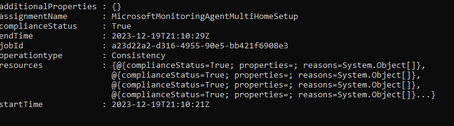

# MultiHome The Microsoft Monitoring Agetnt With AzurePolicy, Guest Configuration and PowerShell DSC

Each environment will have a unique set of files for this solution. Before deploying the solution please ensure that the Azure Guest Configuration exention is deployed in your environment. 

Follow the steps below to author the configuration:

1. Upload the Microsoft Monitoring Agent (MSI) file to a storage account container
2. Install the machine configuration DSC resource module from PowerShell Gallery. Reference - [Setup up local machine for authoring](https://learn.microsoft.com/en-us/azure/governance/machine-configuration/how-to-set-up-authoring-environment)

```powershell
Install-Module -Name GuestConfiguration
```

3. Using PowerShell 5.1, author the DSC coniguration. Reference - [Author a configuration](https://learn.microsoft.com/en-us/azure/governance/machine-configuration/how-to-create-package#author-a-configuration)

```powershell

. .\MicrosoftMonitoringAgentMultiHomeSetup.ps1

Rename-Item -Path .\localhost.mof -NewName MicrosoftMonitoringAgentMultiHomeSetup.mof -PassThru

```

4. Using PowerShell 7.3 - create a package that will audit and apply the configuration (Set).

Example

```powershell

# Create a package that will audit and apply the configuration (Set).
$params = @{
    Name          = 'MicrosoftMonitoringAgentMultiHomeSetup'
    Configuration = './MicrosoftMonitoringAgentMultiHomeSetup.mof'
    Type          = 'AuditAndSet'
    Force         = $true
}
New-GuestConfigurationPackage @params

```

5. Use Get-BlobContext to store the context of your storage account. Reference - [Publish a configuration package](https://learn.microsoft.com/en-us/azure/governance/machine-configuration/how-to-publish-package#publish-a-configuration-package)

6. To test the package run the following:

```powershell
# Get the current compliance results for the local machine
Get-GuestConfigurationPackageComplianceStatus -Path ./MicrosoftMonitoringAgentMultiHomeSetup.zip

# Test applying the configuration to local machine
Start-GuestConfigurationPackageRemediation -Path ./MyConfig.zip

```

7. To create the policy definition run the following lines of code

```powershell

$PolicyConfig      = @{
    PolicyId      = New-Guid
    ContentUri    = $contentUri
    DisplayName   = 'Microsoft Monitoring Agent audit and set policy'
    Description   = 'Microsoft Monitoring Agent audit and set policy'
    Path          = './DetectMicrosoftMonitoringAgentMultiHomeNotExists.json'
    Platform      = 'Windows'
    PolicyVersion = '1.0.0'
    Mode          = 'ApplyAndAutoCorrect'
  }

  New-GuestConfigurationPolicy @PolicyConfig
```

8. To import the policy into your Azure environment

```powershell
New-AzPolicyDefinition -Name 'Name of the policy' -Policy '.\yourfile.json'

```

9. Expected outcomes

When checking the compliance status interactively via a Powershell 5.1 PowerShell session

```powershell
Get-GuestConfigurationPackageComplianceStatus -Path ./MicrosoftMonitoringAgentMultiHomeSetup.zip
```



When checking the compliance status via the Azure Portal
